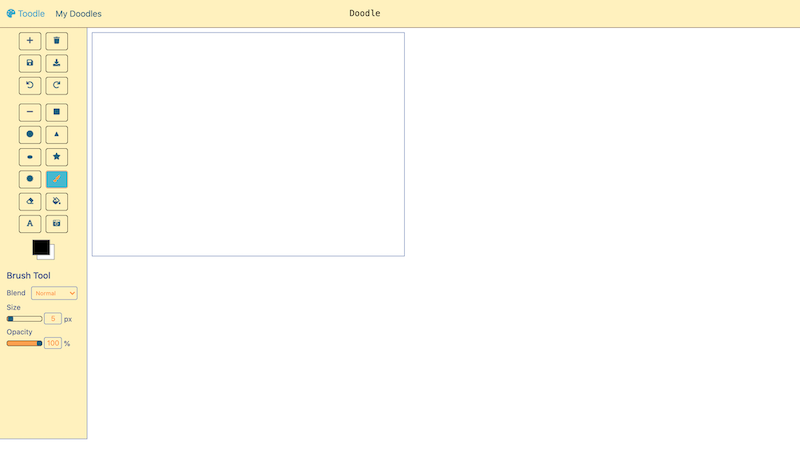

# Welcome to Toodle
Toodle is a web drawing app that helps to bring out your imagination and creativity.

## Table of Contents
* [Live Demo](#live-demo)
* [Features](#features)

## Live Demo
You can play around with Toodle [here](https://toodlepaint.herokuapp.com/).

Click on the "+" button on the top left to get started.

## Features
Toodle offers twelve tools each with various options to customize your masterpiece.

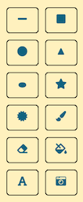

Tools Available:
- Line Tool
- Rectangle Tool
- Circle Tool
- Triangle Tool
- Ellipse Tool
- Start Tool
- Polygon Tool
- Brush
- Eraser
- Paint Bucket Tool
- Text Tool
- Photo Tool

### Line Tool
The line tool has multiple blend mode options. Users can also adjust the size and opacity.

Blend Modes Available:
- Normal
- Multiply
- Screen
- Lighten
- Darken
- Difference

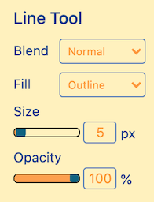

### Rectangle Tool
The rectangle tool allows users to draw rectangles. It also has multiple blend and fill modes. The border size can be adjusted as well.

Fill Modes Available:
- Outline
- Fill
- Outline and Fill

Blend modes are the same as the line tool

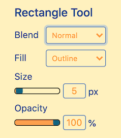

### Circle Tool
The circle tool allows users to draw perfect circles.

All the blend and fill modes from the rectangle tools are also available for this tool.

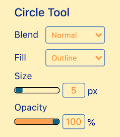

### Triangle Tool
The triangle tool allows users to draw triangles.

All the blend and fill modes from the rectangle tools are also available for this tool.

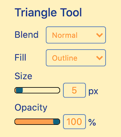

### Ellipse Tool
The ellipse tool allows users to draw ellipses.

All the blend and fill modes from the rectangle tools are also available for this tool.

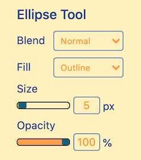

### Star Tool
The star tool allows users to draw stars. Users can adjust the number of points on the star.

All the blend and fill modes from the rectangle tools are also available for this tool.

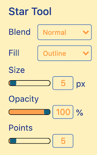

### Polygon Tool
The polygon tool is a shape-shifting tool. Users can adjust the points and inner radius of the shape.

All the blend and fill modes from the rectangle tools are also available for this tool.

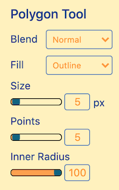

### Brush Tool
The staple of every drawing app.

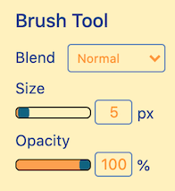

### Eraser
Allows you to erase strokes and shapes so that you're not afraid to experiment.

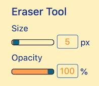

### Bucket Tool
This tool allows the user to color in shapes.

### Text Tool
A tool for stamping texts on the canvas.

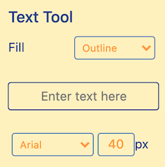

### Photo Tool
Allows users to play with multiple filters and take pictures. Users can draw on the pictures afterwards.

Filters Available:
- Red Shift
- Blue Shift
- Green Shift
- Scramble
- B&W
- Negative

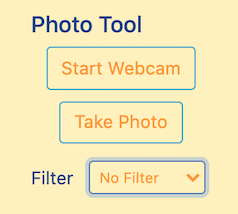

## Comparison

You decide.